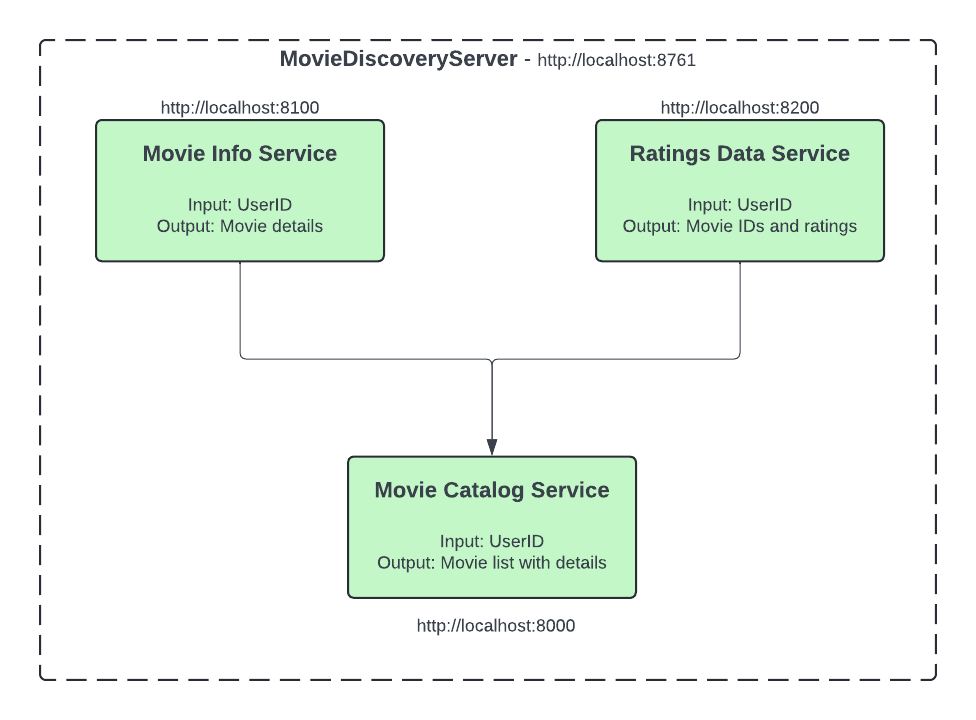

# Microservice Demo

This project demonstrates a microservice architecture for simple Movie Catalog service. This architecture employs web client to facilitate communication between services which is load balanced.
It consists of the following services:
- Movie Discovery Server: Eureka Server for service discovery
- Movie Info Service: Provides movie information like name, description, etc.
- Movie Rating Service: Provides movie ratings and user ratings
- Movie Catalog Service: Aggregates movie information and ratings

## Prerequisites

Before running the code, make sure you have the following:

- Java Development Kit (JDK) installed
- Spring Boot installed
    - Spring Web
    - Eureka Discovery Client
    - Eureka Server
    - Lombok
    - WebClient
- Maven installed
- An IDE like IntelliJ IDEA or Eclipse
- Postman or any other API testing tool

## Getting Started

1. Clone this repository to your local machine. Go to the project directory.
2. Open the project in your favorite Java IDE.
3. Run the applications in the following order:
    - `MovieDiscoveryServerApplication.java` (Discovery Server) [Port: 8761]
    - `MovieInfoServiceApplication.java` (Movie Info Service) [Port: 8100]
    - `MovieRatingServiceApplication.java` (Movie Rating Service) [Port: 8200]
    - `MovieCatalogServiceApplication.java` (Movie Catalog Service) [Port: 8000]
4. Access the Movie Catalog Service at `http://localhost:8000`.
5. Use Postman or any other API testing tool to test the endpoints.
    - Refer to the API documentation [here](Movie Microservices.postman_collection.json).